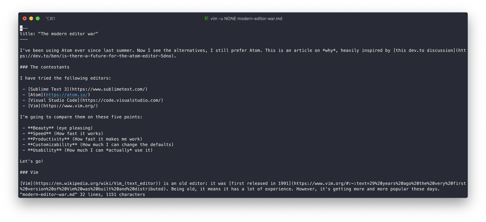
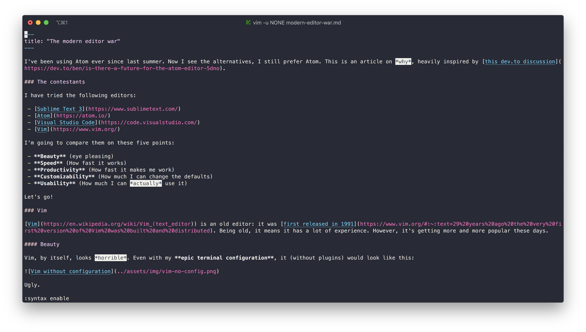
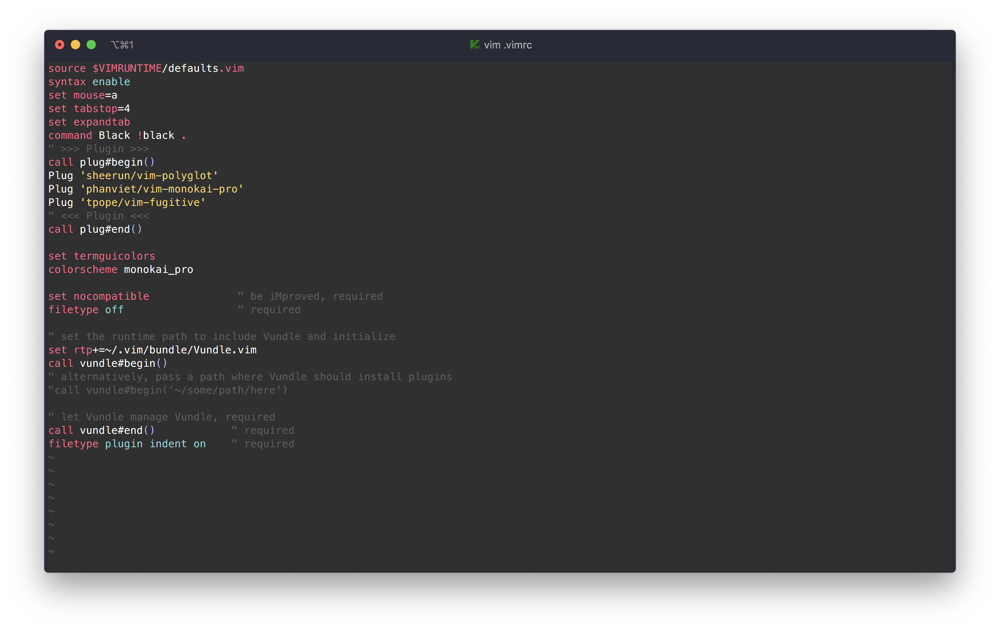
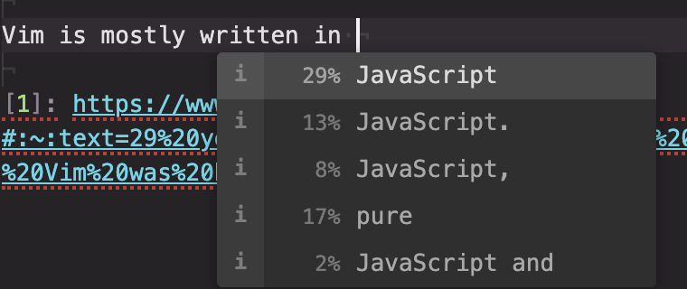
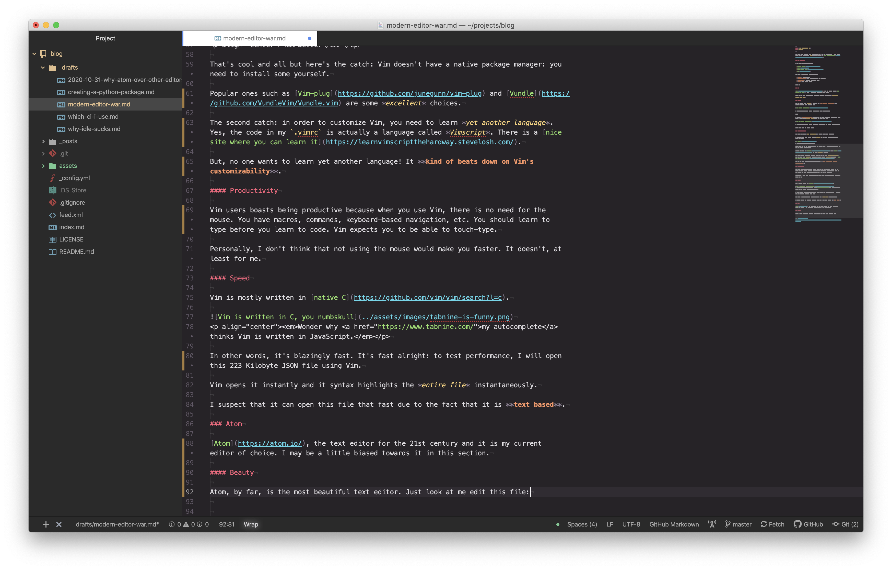
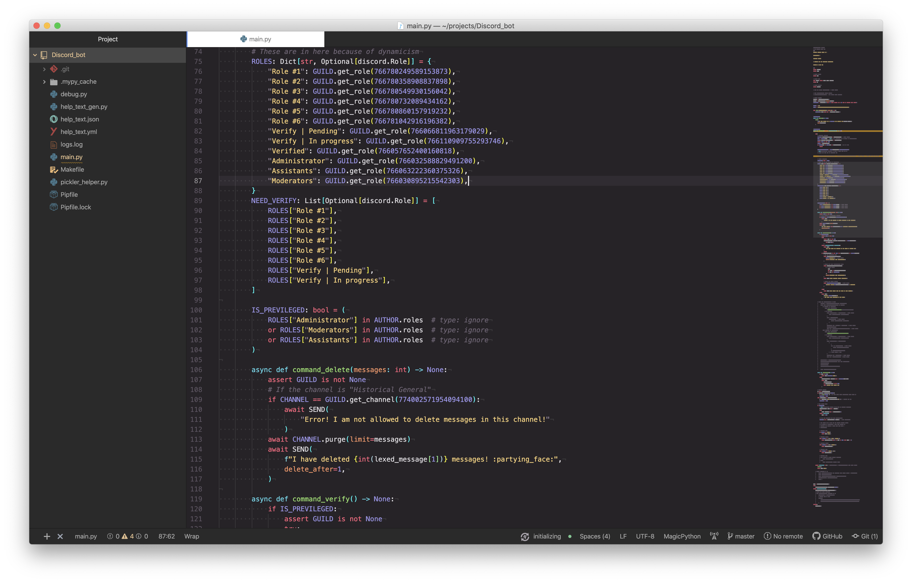
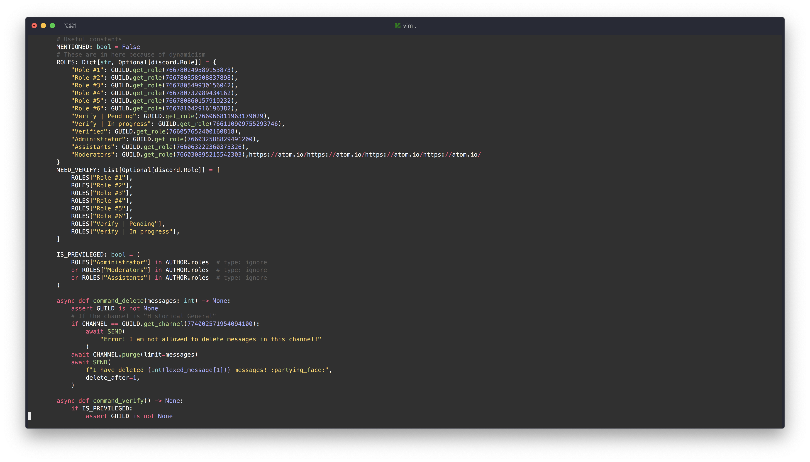

I've been using Atom ever since last summer. Now I see the alternatives, I still prefer Atom. This is an article on *why*, heavily inspired by [this dev.to discussion](https://dev.to/ben/is-there-a-future-for-the-atom-editor-5dno).

### The contestants

I have tried the following editors:

 - [Sublime Text 3](https://www.sublimetext.com/)
 - [Atom](https://atom.io/)
 - [Visual Studio Code](https://code.visualstudio.com/)
 - [Vim](https://www.vim.org/)

I'm going to compare them on these 4 points:

 - **Beauty** (eye pleasing)
 - **Customizability** (How much I can change the defaults)
 - **Productivity** (How fast it makes me work)
 - **Speed** (How fast it works)

Let's go!

Note: I'm not going to compare the proprietary editor (Sublime Text) in this blog post for legal reasons.

### Vim

[Vim](https://en.wikipedia.org/wiki/Vim_(text_editor)) is an old editor: it was [first released in 1991][1]. It is a text-based, mode-based, text editor.

Vim is also built-in the on Mac. Type `vim` or `vi` in your command line and a vim editor should appear.'

Vim on the Mac Terminal

Being old, it means it has a lot of experience. However, it's getting *more and more popular these days.*

#### Beauty

Vim, by itself, looks *horrible*. Even with my **epic terminal configuration**, it (without plugins) would look like this:

<em>Vim without configuration (very ugly)</em>

Ugly.

Of course, **you can configure it**. First off, we would want syntax highlighting. To do that, one would type `:syntax enable`. Now, Vim looks like this:

<em>Vim without with syntax highlighting (no monokai theme!)</em>

Still kinda ugly, but it gets better.

#### Customizability

Vim boasts for being *super customizable*. At least, that's it's potential.

To customize vim, you'd need to edit the `.vimrc` in your home directory. The `.vimrc` is kind of like Atom's init file but for Vim. For me, it looks like this:

<em>Better</em>

That's cool and all but here's the catch: Vim doesn't have a native package manager: you need to install some yourself.

Popular ones such as [Vim-plug](https://github.com/junegunn/vim-plug) and [Vundle](https://github.com/VundleVim/Vundle.vim) are some *excellent* choices.

The second catch: in order to customize Vim, you need to learn *yet another language*. Yes, the code in my `.vimrc` is actually a language called *Vimscript*. There is a [nice site where you can learn it](https://learnvimscriptthehardway.stevelosh.com/).

But, no one wants to learn yet another language! It **kind of beats down on Vim's customizability**.

#### Productivity

Vim users boasts being productive because when you use Vim, there is no need for the mouse. You have macros, commands, keyboard-based navigation, etc. You should learn to type before you learn to code. Vim expects you to be able to touch-type.

Personally, I don't think that not using the mouse would make you faster. It doesn't, at least for me.

#### Speed

Vim is mostly written in [native C](https://github.com/vim/vim/search?l=c).

<em>Wonder why <a href="https://www.tabnine.com/">my autocomplete</a> thinks Vim is written in JavaScript.</em>

In other words, it's blazingly fast. It's fast alright: to test performance, I will open this 223 Kilobyte JSON file using Vim.

Vim opens it instantly and it syntax highlights the *entire file* **instantaneously**.

I suspect that it can open this file that fast due to the fact that it is **text based**.

### Atom

[Atom](https://atom.io/), the text editor for the 21st century and it is my current editor of choice. I may be a little biased towards it in this section.

#### Beauty

Atom, by far, is the most beautiful text editor. Just look at me edit this file:

<em>Beautiful</em>

Hmm, looks kind of ugly. Let's try again. Look at me edit this python script:

<em>A discord.py bot script</em>

Compared to Vim:

<em>"Vimming"</em>

Well, Vim may seem a little *more clean*: less icons, etc. That's because I haven't customized it that much. Atom, on the other hand, has awesome defaults and an epic UI, giving it a modern feel.

It is a *graphical editor*, unlike Vim.

The thing I don't like is the logo. Ugh.

#### Customizability

I would argue that Atom *is more customizable than Vim*. Why? Well, since customizing Atom only requires some knowledge of **web technologies**, while Vim requires you to learn **yet another language**. Secondly, Atom has a package manager. You either use the GUI (in Atom) or use the CLI tool, `apm`.

Technically, Atom requires you to know *JavaScript/CoffeeScript* and/or *CSS and HTML* but most people *do* know that: just look at **how many websites we have on the internet**! Want to edit some color? **Edit the stylesheet**. Want to add some epic functionality? **Hack the init file**. 

Some may argue that Atom is ["bloated, hard to configure, and still didn't do what I want."][2]. However, I disagree: customizing it is as simple as <kbd>⌘</kbd> + <kbd>⌥</kbd> + <kbd>i</kbd> (Command + Option + i on a Mac), **selecting the element**, **find the classes**, and **edit the stylesheet**. In other words, **changing the css of the element**.

Atom is built on [Electronjs](https://www.electronjs.org/) (formerly known as the Atom Shell) which is a framework for creating cross-platform desktop applications from HTML. Atom is so customized that it technically is a website you can hack on. That's what makes it unique: as customizable as Emacs or Vim **but easier**.

(When I say "hack", I mean by customize)

#### Productivity

I use Atom as an alternative to Sublime Text. It has the usual features: multiple cursors, regex find (and replace), split panes, (magnificent) git integration, autocomplete, go to definition (plugin), terminal emulation (plugin), etc, etc, markdown renderer, etc, etc, and even a pizza delivery service! Just kidding about the last part (though it could become a real thing).

One of the best part of Atom is the [Teletype](https://teletype.atom.io/) feature. It allows you to code with your team in real time, kind of like google docs for code except that it is **peer-to-peer**.

#### Speed

Atom isn't exactly the fastest editor in the world; there is no way it can compete with Vim or Sublime Text. But it isn't as slow as most other **outdated blog posts** claim. While the start-up time is usually 3 to 4 seconds (about the same as Visual Studio Code), Atom sacrifices some speed for customizability.

It is still usable though: for me, it hasn't lagged/crashed unexpectedly.

Again, I used Atom to open the humungous JSON file. It took the usual 3 seconds to load a new Atom window (including executing the init file) but it took a solid *12 seconds* to syntax highlight the entire JSON file.

It didn't crash or freeze when I scrolled immediately to the bottom, it's just a little slower on highlighting the entire file. Maybe it's because of the fact that I disabled the [tree-sisters](https://tree-sitter.github.io/tree-sitter/) parsing. Nevertheless, I could still interact with Atom decently fast.

### VS Code

[VS Code](https://code.visualstudio.com/), or Visual Studio Code, is what I call Atom's younger brother. Like Atom, VS Code is built on top of Electronjs. Unlike Atom, it is a Microsoft product.

##### Beauty

The UI isn't as bad as it was but it *still* isn't as comparable as Atom.

[1]: https://www.vim.org/#:~:text=29%20years%20ago%20the%20very%20first%20version%20of%20Vim%20was%20built%20and%20distributed

[2]: https://dev.to/ben/is-there-a-future-for-the-atom-editor-5dno#:~:text=bloated%2C%20hard%20to%20configure%2C%20and%20still%20didn't%20do%20what%20I%20want.
