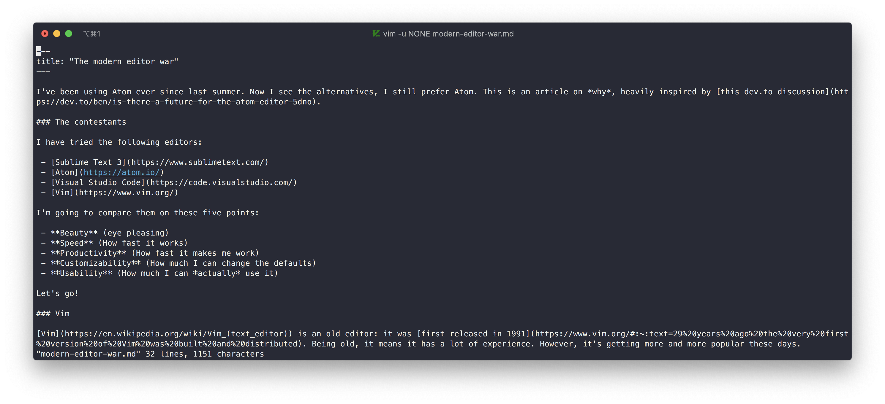
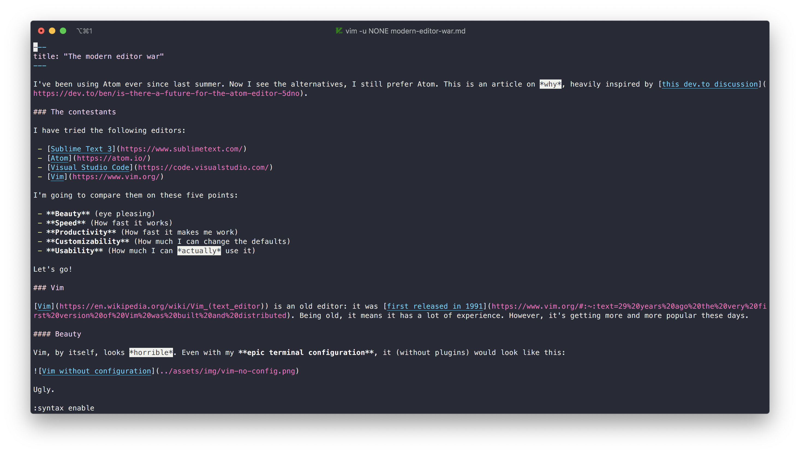
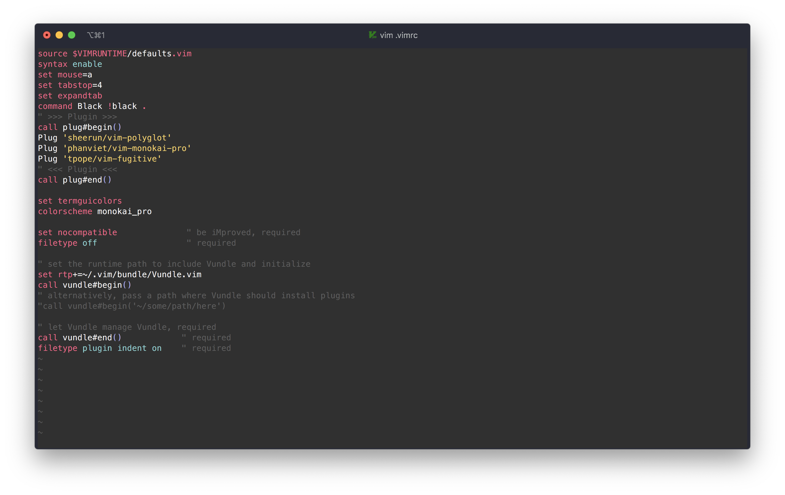
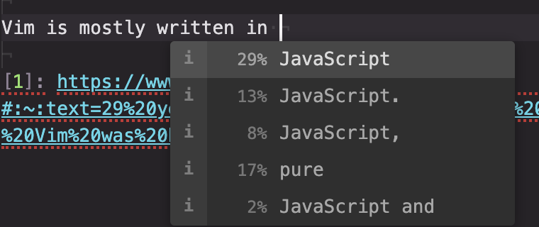
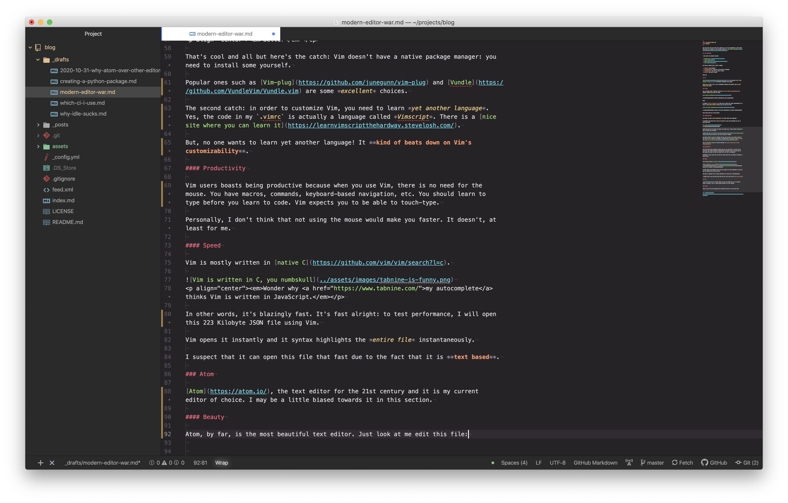
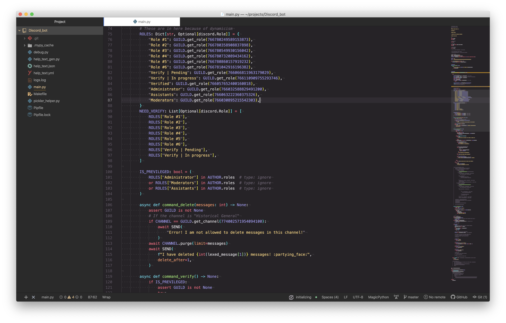
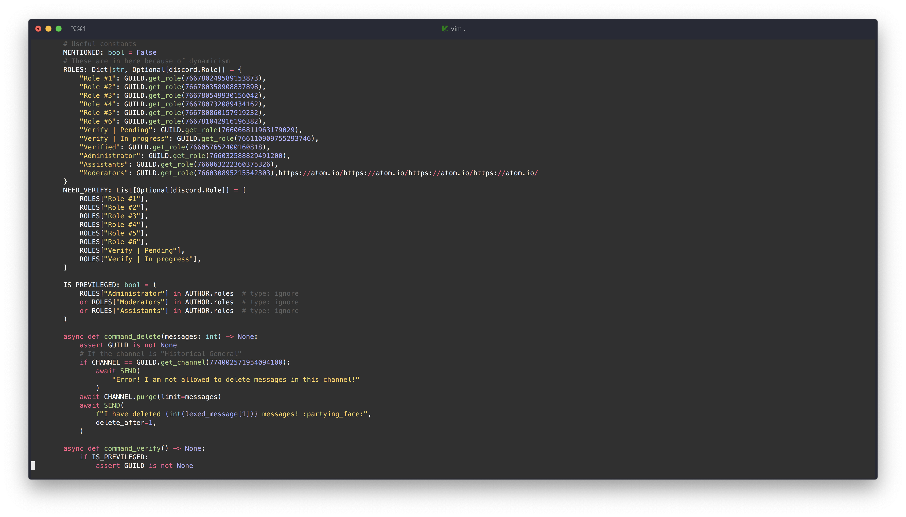

I've been using Atom ever since last summer. Now I see the alternatives, I still prefer Atom. This is an article on *why*, heavily inspired by [this dev.to discussion](https://dev.to/ben/is-there-a-future-for-the-atom-editor-5dno).

### The contestants

I have tried the following editors:

 - [Sublime Text 3](https://www.sublimetext.com/)
 - [Atom](https://atom.io/)
 - [Visual Studio Code](https://code.visualstudio.com/)
 - [Vim](https://www.vim.org/)

I'm going to compare them on these 4 points:

 - **Beauty** (eye pleasing)
 - **Customizability** (How much I can change the defaults)
 - **Productivity** (How fast it makes me work)
 - **Speed** (How fast it works)

Let's go!

Note: I'm not going to compare the proprietary editor (Sublime Text) in this blog post for legal reasons.

### Vim

[Vim](https://en.wikipedia.org/wiki/Vim_(text_editor)) is an old editor: it was [first released in 1991][1]. It is a text-based, mode-based, text editor.

Vim is also built-in the on Mac. Type `vim` or `vi` in your command line and a vim editor should appear.'

Vim on the Mac Terminal

Being old, it means it has a lot of experience. However, it's getting [*more and more popular these days.*](https://dev.to/iggredible/why-i-use-vim-2f40)

#### Beauty

Vim, by itself, looks *horrible*. Even with my **epic terminal configuration**, it (without plugins) would look like this:

<em>Vim without configuration (very ugly)</em>

Ugly.

Of course, **you can configure it**. First off, we would want syntax highlighting. To do that, one would type `:syntax enable`. Now, Vim looks like this:

<em>Vim without with syntax highlighting (no monokai theme!)</em>

Still kinda ugly, but it gets better.

#### Customizability

Vim boasts for being *super customizable*. At least, that's it's potential.

To customize vim, you'd need to edit the `.vimrc` in your home directory. The `.vimrc` is kind of like Atom's init file but for Vim. For me, it looks like this:

<em>Better</em>

That's cool and all but here's the catch: Vim doesn't have a native package manager: you need to install some yourself.

Popular ones such as [Vim-plug](https://github.com/junegunn/vim-plug) and [Vundle](https://github.com/VundleVim/Vundle.vim) are some *excellent* choices.

The second catch: in order to customize Vim, you need to learn *yet another language*. Yes, the code in my `.vimrc` is actually a language called *Vimscript*. There is a [nice site where you can learn it](https://learnvimscriptthehardway.stevelosh.com/).

But, no one wants to learn yet another language! It **kind of beats down on Vim's customizability**.

#### Productivity

Vim users boasts being productive because when you use Vim, there is no need for the mouse. You have macros, commands, keyboard-based navigation, etc. You should learn to type before you learn to code. Vim expects you to be able to touch-type.

Personally, I don't think that not using the mouse would make you faster. It doesn't, at least for me.

#### Speed

Vim is mostly written in [native C](https://github.com/vim/vim/search?l=c).

<em>Wonder why <a href="https://www.tabnine.com/">my autocomplete</a> thinks Vim is written in JavaScript.</em>

In other words, it's blazingly fast. It's fast alright: to test performance, I will open this 223 Kilobyte JSON file using Vim.

Vim opens it instantly and it syntax highlights the *entire file* **instantaneously**.

I suspect that it can open this file that fast due to the fact that it is **text based**. It doesn't need to render complicated graphics, etc, so yeah.

### Atom

[Atom](https://atom.io/), the text editor for the 21st century and it is my current editor of choice. I may be a little biased towards it in this section.

#### Beauty

Atom, by far, is the most beautiful text editor. Just look at me edit this file:

<em>Beautiful</em>

Hmm, looks kind of ugly. Let's try again. Look at me edit this python script:

<em>A discord.py bot script</em>

Compared to Vim:

<em>"Vimming"</em>

Well, Vim may seem a little *more clean*: less icons, etc. That's because I haven't customized it that much. Atom, on the other hand, has awesome defaults and an epic UI, giving it a modern feel.

It is a *graphical editor*, unlike Vim.

One problem, The logo *isn't* exactly the best.

<em>Kinda sucks, don't you think?</em>

#### Customizability

I would argue that Atom *is more customizable than Vim*. Why? Well, since customizing Atom only requires some knowledge of **web technologies**, while Vim requires you to learn **yet another language**. Secondly, Atom has a package manager. You either use the GUI (in Atom) or use the CLI tool, `apm`.

Technically, Atom requires you to know *JavaScript/CoffeeScript* and/or *CSS and HTML* but most people *do* know that: just look at **how many websites we have on the internet**! Want to edit some color? **Edit the stylesheet**. Want to add some epic functionality? **Hack the init file**.

Some may argue that Atom is ["bloated, hard to configure, and still didn't do what I want."][2]. However, I disagree: customizing it is as simple as <kbd>⌘</kbd> + <kbd>⌥</kbd> + <kbd>i</kbd> (Command + Option + i on a Mac), **selecting the element**, **find the classes**, and **edit the stylesheet**. In other words, **changing the css of the element**.

Atom is built on [Electronjs](https://www.electronjs.org/) (formerly known as the Atom Shell) which is a framework for creating cross-platform desktop applications from HTML. Atom is so customized that it technically is a website you can hack on. That's what makes it unique: as customizable as Emacs or Vim **but easier**.

(When I say "hack", I mean by customize)

#### Productivity

I use Atom as an alternative to Sublime Text. It has the usual features: multiple cursors, regex find (and replace), split panes, (magnificent) git integration, autocomplete, go to definition (plugin), terminal emulation (plugin), etc, etc, markdown renderer, etc, etc, and even a pizza delivery service! Just kidding about the last part (though it could become a real thing).

One of the best part of Atom is the [Teletype](https://teletype.atom.io/) feature. It allows you to code with your team in real time, kind of like google docs for code except that it is **peer-to-peer**.

Atom's package library is vast and contains many useful packages.

#### Speed

Atom isn't exactly the fastest editor in the world; there is no way it can compete with Vim or Sublime Text. But it isn't as slow as most other **outdated blog posts** claim. While the start-up time is usually 3 to 4 seconds (about the same as Visual Studio Code), Atom sacrifices some speed for customizability.

Again, I used Atom to open the humungous JSON file. It took the usual 3 seconds to load a new Atom window (including executing the init file) but it took a solid *12 seconds* to syntax highlight the entire JSON file.

It didn't crash or freeze when I scrolled immediately to the bottom, it's just a little slower on highlighting the entire file. Maybe it's because of the fact that I disabled the [tree-sisters](https://tree-sitter.github.io/tree-sitter/) parsing. If it was enabled, the syntax highlighting is **super fast**. Nevertheless, I could still interact with Atom decently fast. In fact, I even opened the entire Python repository in Atom (and it still didn't crash).

### VS Code

[VS Code](https://code.visualstudio.com/), or Visual Studio Code, is what I call Atom's younger brother. Like Atom, VS Code is built on top of Electronjs. Unlike Atom, it is a Microsoft product. And unlike Vim, it's quite new. ~~Also, it's getting more and more popular~~

#### Beauty

The UI isn't as bad as it was but it *still* isn't as comparable as Atom. There are these ugly icons on the left. Although you can hide them, you're going to be loosing functionality. Then again, Microsoft isn't exactly the best at UI so I'll cut them some slack. 

The thing is, if you don't care about how your editor looks, I actually **highly recommend VS Code**.

#### Customizability

Although not being as beautiful as Atom, one might think you can customize it to remove them, right? Well, not exactly: VS Code's API isn't as powerful as Atom. You can't create a completely new component of the UI nor can you [add some epic special effects while you type](https://atom.io/packages/activate-power-mode) in VS Code (well, [kinda](https://github.com/hoovercj/vscode-power-mode) but [not really](https://code.visualstudio.com/api/extension-capabilities/overview#restrictions)). But, ironically, there are more packages on VS Code than on Atom. I guess it's due to it's rising popularity. Or maybe that it uses [TypeScript](https://www.typescriptlang.org) instead of [CoffeeScript](https://coffeescript.org). Or maybe that it's extension API is enough for most. Or maybe that some extensions are propriatary.

I have one thing to critique though.

Making themes in VS Code is limited to the selectors they give you. Although that has *some* advantages, it isn't as powerful as CSS selectors (Atom).

#### Productivity

VS Code comes *packed* with functionality, out of the box. This is actually one of the reasons why I don't like it but some other people like this. Some of it's functionality are!

- A built-in debugger
- A built-in linter
- An integrated terminal
- Built-in refactoring capabilities
- blah blah blah...

The list goes on. The more it goes, the more VSCode seems like an IDE. It kinda is.

Atom requires a (deprecated) package for this. Like [Nuclide](https://nuclide.io) or [PlatformIO](https://docs.platformio.org/en/latest/integration/ide/atom.html) (wait that's maintained) or [Atom IDE UI](https://ide.atom.io). Did I say deprecated? Atom has [atom-community](https://github.com/atom-community/atom-languageclient) now but it took me a while to figure out how Atom stands in the IDE world.

VS Code has all that built in, as I said above.

Wait, I never said I didn't use VS Code. ~~Well I actually use [VS Codium](https://vscodium.com) but that's pretty much the same.~~ I mainly use the debugger for Python. Goodbye print statement debugging! ~~I have no clue how to use the [pdb](https://docs.python.org/3/library/pdb.html) anyway~~.

All in all, VS Code is quite productive if you know how to use it (see Vim). Although I personally don't like it having so much features to learn, I guess it would be fit for other people. 

~~Not to mention the .vscode folder it adds to your repo storing the per-project settings~~.

#### Speed
 
From the guys who've been making text editors for years, VS Code is pretty fast, especially for an Electron App. Although it's not being as fast as Vim, it feels faster than Atom, overall. I opened that JSON file in VS Code and it syntax highligted it instantly.

### Conclusion

In conclusion, all editors are good for other people. Use Vim if you want to use an editor that has high potential (but a steep learning curve); use Atom if you want a customizable (extending functionality or appearence) editor; and VS Code if you want a general purpose editor with IDE-like capabilities.

[1]: https://www.vim.org/#:~:text=29%20years%20ago%20the%20very%20first%20version%20of%20Vim%20was%20built%20and%20distributed

[2]: https://dev.to/ben/is-there-a-future-for-the-atom-editor-5dno#:~:text=bloated%2C%20hard%20to%20configure%2C%20and%20still%20didn't%20do%20what%20I%20want.
