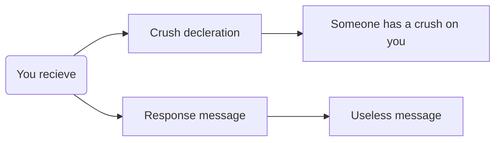
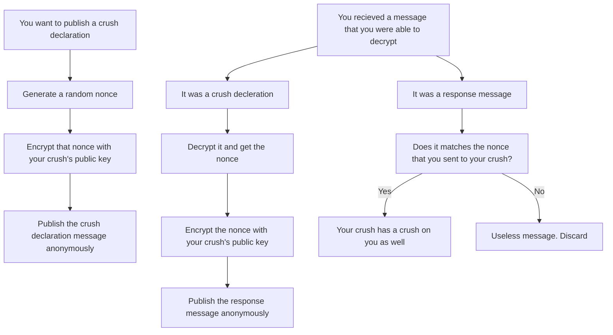

<!-- TODO: Mermaid diagrams -->

So I had an idea. At first, I thought it was quite dumb and simple. But the more I thought about it, the harder it seemed. It was a problem.

I shared it with a friend. We couldn't think of a good way to solve it. I [shared it with an AI](https://shareg.pt/EowiFo3). It basically gave up (without admitting it).

## The problem

Let's pretend that I was going to build an app. In this app, you input who you have a crush on, and if you and your crush have a crush on each other, then the app tells you that. Ignore all possibilities of someone lying that they have a crush on someone or someone impersonating another person IRL. This is a purely cryptographic/algorithmic problem.

Seems pretty simple, right? Alice tells the app she has a crush on Bob. When Bob tells the app that he has a crush on Alice, the server will tell them both that they have a crush on each other. Specifically, they realize that

$$
\text{Bob} \in \text{Alice's Crushes} \land \text{Alice} \in \text{Bob's Crushes}
$$

The catch is this: **privacy**. Nobody is allowed to know (or it is infeasible to know) that **X has a crush on Y _unless_ Y also has a crush on X**; if so, **only X and Y are allowed to know** that **they have a crush on each other**. "Nobody" includes the server that runs the app, so this app might as well be decentralized (doesn't need to be though).

In other words, here are the constraints:

1. Every user of the app only has one action: submitting a new crush name to the app (which we will call "posting the crush" or "announcing the crush" or simply "announcement"). This could mean submitting a message to a server or adding a block anonymously in a blockchain like [Zerocoin/Zerocash](https://en.wikipedia.org/wiki/Zerocoin_protocol#Zerocash).
2. It must be infeasible for everyone (and the server) to know that X has a crush on Y
3. Y cannot know that X has a crush on it unless Y has posted that it has a crush on X

From this, several more constraints may be derived:

4. Posting the crush must be anonymous if the message posted has an indicated or derivable target (or else this violates constraint 2 or 3, respectively)
5. Any sort of protocol requiring individual participation (e.g. Bob has to go through some verification protocol requiring Alice's participation) is prohibited; it violates constrant number 3 since it indicates that Bob has a crush on Alice since there is no other reason why he would try to go through such a protocol.
6. In other words, all protocols must be made with everyone (and not to special individuals)

For now (since this problem was so hard), I won't consider the following constraints:

7. The protocol must work even with malicious clients or servers. Note that verification of identity is still required.
8. Any type of brute forcing that violates constraint 2 or 3 is prohibited.

# Attempted solutions

## Simple Hashes

The naive solution would be to tell the app $H(\text{Alice} + \text{Bob})$ in order to announce that Alice has a crush on Bob. Here, $H$ is some one-way function like a cryptographic hash such as [SHA-2](https://en.wikipedia.org/wiki/SHA-2) or [BLAKE3](<https://en.wikipedia.org/wiki/BLAKE_(hash_function)#BLAKE3>), and the order of concatenation could be sorted/already decided.

Bob can just see $H(\text{Alice} + \text{Bob})$, see if it matches the message of him having a crush on Alice (which in this case is also $H(\text{Alice} + \text{Bob})$).

Note that in this protocol, the announcement **cannot possibly be fully anonymous** since you need to _sign the hash_ to prove that you approved the message.

There are several problems with this:

1. Let's assume Alice and Bob have a crush on each other. So both Alice and Bob would publicly post $H(\text{Alice} + \text{Bob})$, which reveals to other users that they have a crush on each other. This **violates constraint number 2**.
2. Given a hash coming from Bob, we can brute force the hash in $O(\text{amount of users})$ time. This **violates constraint 8**, which we will ignore.
3. But from this, we can test $\text{Sender's message} = H(\text{Sender} + \text{Me})$ first, **violating constraint number 3**.

## Hashes with encryption

Let $X$ = $H(\text{Alice} + \text{Bob})$

Instead of:

- Bob posts $X$
- Alice posts $X$
- Bob and Alice realize that the message the other person posted matches $X$, therefore they have a crush on each other.

We do:

- Bob posts $\text{Sign}(\text{Encrypt}(X, \text{Alice}_{pk}), \text{Bob})$ (meaning signed by Bob encrypted via Alice's public key)
- Alice posts $\text{Sign}(\text{Encrypt}(X, \text{Bob}_{pk}), \text{Alice})$
- Alice finds that she can decrypt Bob's message
- Bob finds that he can decrypt Alice's message

Actually, pause right here: **we don't even need $X$**. Additionally, this protocol _is already broken_: Alice realizes that Bob sent her a message that only she can decrypt. In this current scheme, it can only mean one thing: he has a crush on her. This **violates constraint number 3.**

Quote from my conversation with my friend:

> There is no reason why Bob would send a message to her, encrypted using her key, besides trying to tell her X. If Bob were to send X to everyone (encrypted individually), that defeats the purpose of encrypting in the first place.

## Constant Sending

Finally, my friend thinks of the first solution that may work decently well. To quote:

> now, there would be the 2iq solution of making everyone sending a crush message like every day, with those who didnt send them send a fake one directed at like "eve", so you couldnt determine who is real.

For example:

> like if bob has a crush, the client doesnt send it right away, like it sends at midnight utc. all other clients also do the same thing except if they dont have a target crush(or already sent one) they send a message with the crush being "eve" or someone, making knowing who sent messages useles

So this actually satisfies the necessary constraints. The problem with it should be pretty obvious:

> But like you can’t force clients to be sending messages 24/7

## Simple commitment scheme

But why do we need to? Although, I didn't think of this during the conversation, here's an idea: why do we need to constantly send messages? So you couldn't determine which messages were "real", or intended for Alice. That wouldn't matter if Alice didn't know who you were...

A new protocol could work like:

- Let $X$ equal some random cryptographic commitment using some [commitment scheme](https://en.wikipedia.org/wiki/Commitment_scheme)
- Somebody sent $\text{Encrypt}(X, \text{Alice}_{pk})$. Anonymizing could be done with something like Zerocoin.
- Alice decrypts it (because she can) and finds $X$. She assumes that it was from her crush (if she has one), and anonymously posts $\text{Encrypt}(X, \text{Bob}_{pk})$ (assuming her crush is Bob)
- If Bob had sent the original message (i.e. being that "someone"), he would realize that Alice has a crush on him as well. Remember, we're assuming that nobody is lying about having a crush. They can talk with each other later (maybe using a symmetrically encrypted message encrypted via some shared secret, possibly generated using the [Diffie-Hellman key exchange](https://en.wikipedia.org/wiki/Diffie%E2%80%93Hellman_key_exchange)), relaying this information.
- Otherwise, Bob would send it to his crush, and so on. This could end up pretty badly...

I haven't thought of this through yet.

### Perfect solution??

After a month of stagnant progress, I suddenly realized that the previous solution would work perfectly if a minor fix was added. I'll get to that solution [later in this post](#the-perfect-solution). For now, here's the solutions I've tried to think of before that epiphany.

## Custom key pair

> ok how about
> A = H(Bob + Alice) - this means that Bob has a crush on Alice
> B = H(Alice + Bob) - meaning Alice has a crush on Bob
>
> Let C be a message C (which everyone knows) encrypted by A (which nobody knows) that can only be decrypted by B
> brute-forcing B now requires O(N(N-1)) = O(N^2) operations

> who would be sending C

> it doesnt matter
> he can send it to everyone

> [that] makes decryption easier
> if you know who one of the people is
> thats o(n)

Which **violates constraint 8**. But also, I actually haven't thought this onr through yet,

## ChatGPT attempts

I tried to get ChatGPT to solve this.

### ZKP

> 1.  Alice and Bob both register and create an account on the app, generating their own public and private cryptographic keys.
> 2.  Alice and Bob each create a commitment to the person they have a crush on using a cryptographic commitment scheme, and exchange their commitments without revealing the actual identities of the persons they have a crush on.
> 3.  Alice and Bob then use a Zero-Knowledge Proof (ZKP) protocol to prove to each other that the commitment they received matches the identity of the person they have a crush on, without revealing the actual identity to each other or to any third party.
> 4.  If the ZKP protocol verifies successfully for both Alice and Bob, it means that they each have a crush on the person they claimed in their respective commitments.
> 5.  Alice and Bob then use a cryptographic key agreement protocol, such as Diffie-Hellman or another secure key exchange protocol, to establish a shared secret that is known only to them. This shared secret can be used as a basis for confirming their mutual crush on each other.
> 6.  If the cryptographic key agreement protocol is successful and they are able to establish a shared secret, it confirms that they both have a mutual crush on each other, as they were able to agree on a secret that only they know, without revealing this information to the app's servers or any other unauthorized parties.

The problem with this is that it **violates constraint number 3**:

> Yes, you are correct. In the process described in the previous response, Bob's willingness to go through the arduous process with Alice would indeed indicate that Bob has a crush on Alice.

### SMPC

> 1. Alice and Bob both register and create an account on the app, generating their own public and private cryptographic keys.
> 2. When Alice wants to check if Bob has a crush on her, she encrypts her own identity (e.g., her username) using her private key and Bob's public key, and sends it to the app's servers.
> 3. The app's servers then perform an SMPC protocol where they combine the encrypted identity of Alice with the encrypted identity of Bob, without revealing the decrypted identities to anyone, including themselves.
> 4. If the result of the SMPC protocol indicates that Alice and Bob have a mutual crush, the servers generate a notification that is encrypted using Alice and Bob's public keys, and send it to both Alice and Bob.
> 5. Alice and Bob receive the notification, decrypt it using their respective private keys, and can now confirm that they both have a mutual crush, without revealing any information to the app's servers or anyone else.

But this **violates constraint number 2**. Step 4 would reveal to the server that Alice and Bob have a mutual crush. Additionally, having a mutual crush **doesn't necessarily mean that they have a crush on each other**. ChatGPT forgot about this.

In short, when I tried to get ChatGPT to generate a protocol, it eventually ran into a loop. Its proposals fail when I ask it one or more of these questions:

1. The example you gave would only check if Alice and Bob's sets of crushes intersect, not necessarily that Alice has a crush on Bob and Bob has a crush on Alice; what if Alice and Bob has a crush on Sam?
2. If Bob attempts to go through this arduous process with Alice, wouldn't that indicate that Bob has a crush on Alice?
3. How would proving to each other that the commitment they received matches the identity of the person they have a crush on prove that Alice and Bob have a crush on each other?
4. Wouldn't that reveal to the server that Alice and Bob have a mutual crush?

### More ZKP abuse

> Sure, here's a summary of the final protocol that satisfies the privacy constraints:
>
> 1. Each user generates a public-private key pair.
> 2. When a user wants to announce that they have a crush on someone, they use a zero-knowledge proof (ZKP) to prove to the system that they have a crush on someone in the system, without revealing the identity of the person they have a crush on. The announcement is stored anonymously along with the cryptographic proof, without revealing the identity of the person being crushed on.
> 3. The system maintains a list of all the anonymous crush announcements and their associated proofs.
> 4. To determine if there is a mutual crush between two users (Alice and Bob), each of them uses their private key to decrypt all the anonymous announcements and associated proofs.
> 5. Alice and Bob then use a ZKP to prove to each other that they have a crush on each other, without revealing the identity of their respective crushes to anyone else, including the system.
> 6. If the ZKP is successful, Alice and Bob can be assured that they both have a mutual crush on each other, without revealing the identities of their respective crushes to anyone else, including the system.
>    This protocol satisfies all the privacy constraints mentioned in the original problem statement, including anonymity of announcements, infeasibility of knowing who has a crush on whom, and the fact that Y cannot know that X has a crush on it unless Y has posted that it has a crush on X.

### Most promising

Sure, here's an example of the protocol with Bob who has a crush on Alice, and Alice has a crush on Bob:

> 1.  Bob generates a new random secret key $k{Bob}$ and creates a new crush announcement $M{Bob} = Enc_{pkA}(k{Bob})$ encrypted with Alice's public key.
> 2.  Bob posts $M{Bob}$ to the public bulletin board.
> 3.  Alice generates a new random secret key $k{Alice}$ and creates a new crush announcement $M{Alice} = Enc{pkB}(k{Alice})$ encrypted with Bob's public key.
> 4.  Alice posts $M{Alice}$ to the public bulletin board.
> 5.  Bob checks the bulletin board for new announcements. He sees $M{Alice}$, and decrypts it using his private key: $k{Alice} = Dec{skB}(M{Alice})$. Bob then uses $k{Alice}$ to encrypt a message $N{Bob} = Enc_{pkA}(k{Alice})$ and posts it to the bulletin board.
> 6.  Alice checks the bulletin board for new announcements. She sees $M{Bob}$ and $N{Bob}$. She decrypts $M{Bob}$ using her private key: $k{Bob} = Dec_{skA}(M{Bob})$. Alice then uses $k{Bob}$ to encrypt a message $N{Alice} = Enc_{pkB}(k{Bob})$ and posts it to the bulletin board.
> 7.  Bob checks the bulletin board for new announcements. He sees $N{Alice}$ and decrypts it using his private key: $k{Alice} = Dec_{skB}(N{Alice})$. Bob now knows that Alice has a crush on him, and can also see that the encrypted message matches the one he posted in step 5.
> 8.  Alice checks the bulletin board for new announcements. She sees $N{Bob}$ and decrypts it using her private key: $k{Bob} = Dec_{skA}(N{Bob})$. Alice now knows that Bob has a crush on her, and can also see that the encrypted message matches the one she posted in step 6.

> Bob and Alice now both know that they have a mutual crush on each other, without revealing any information to anyone else. They can now proceed to communicate privately and securely without the need for the bulletin board.

But something is wrong...

# Partial solutions

- [Constant sending](#constant-sending)

# The perfect solution

The only reason [a simple commitment scheme](#simple-commitment-scheme) would not work is because there's the case that Bob doesn't actually have a crush on the person who sent a crush declaration message "to" him (remember: he's effectively the receiver since he's the only one able to decrypt the message).

The fix is simple: just differentiate crush declaration messages and response messages. You could implement this as a simple boolean flag.

Even if someone was malicious and tried to forward and propagate the useless message, it would not affect the network in any harmful way (because remember: the nonces are random. Therefore there's unlikely chance of collision).

## Summary

In conclusion, the protocol works like this:

