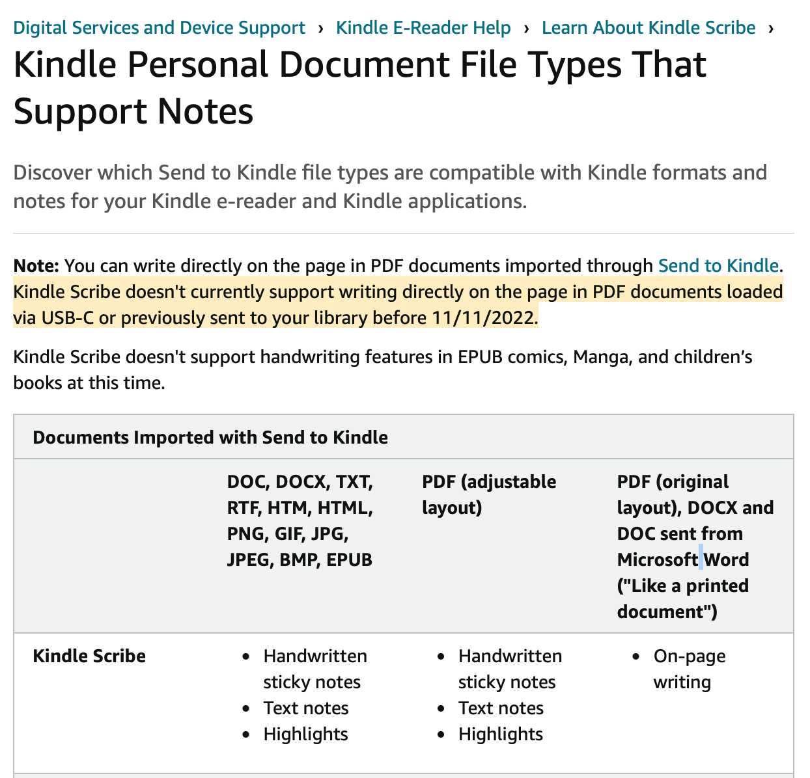

For the Christmas of 2023, my dad gifted me an [Amazon Scribe](https://www.amazon.com/Kindle-Scribe-the-first-Kindle-for-reading-writing-journaling-and-sketching/dp/B0BQPPW5T5) (16 GB), after hearing that I wanted an E-ink tablet such as the [reMarkable](https://remarkable.com) to replace my notebooks. I'm here to document my experience with the Amazon Scribe so far.

This is not really an "objective review" as I'm simply just documenting my experience; some features or limitations that I talk about may not matter to other people.

## My requirements

All I wanted was to be able to replace my notebooks so that my backpack doesn't need to be _20 pounds_ (mostly notebooks, one textbook, and one binder). Of course, not all of my classes will let me be able to replace my notebook with something digital (e.g. math and English require that I turn in some physical notebook), but for classes such as business and biology, I've been using my notebook for note taking solely for my own benefit so it didn't matter if I switched to a different medium.

### How I take notes

Before we start laying out my personal requirements for a digital replacement, I should probably document my current method of taking notes.

As I was using a physical notebook, I couldn't really employ a [Zettelkasten](https://en.wikipedia.org/wiki/Zettelkasten) system (although I will experiment with that next year). That being said, I still (albeit unconsciously until now) employ some form of structure in my notes when learning the new material. I like to call it DEER:

#### DEER notes

For every new concept or term (like people, place, process, event, component), you create a new entry (which could be just using blank space on your existing notebook page or a new note file on a digital system)

- **D**efinition of the new term. This may include (or some examples/inspiration on how to document the definition):
  - Its properties (e.g. year, size, field of study, etc)
  - Input/outputs of the process
  - The textbook definition
  - Your summarized definition
  - The steps in the process (which ten you can recursively make new DEER entries for each of the steps!)
- **E**xamples of this new concept
  - Such as applications or appearances in the real world
  - Example problems
  - Or concrete types or categories of concept (recursive DEER again!)
- **E**xplanation/rationale for this concept
  - Why this instead of whatever? Why can’t you do X instead?
  - How does it do it? How does it work?
  - What's the proof? (if it's a formula or theorem)
  - Why is this important?
- **R**elationship with other concepts (may already be covered by the definition or examples)
  - How does it fit in with other components/concepts?
  - What role/function does this play?
  - How does this affect the greater picture?
  - What would happen if this didn’t exist?
  - What’s the name of the type of relationship? (E.g. “this person is a mentor of X” or “this theorem requires postulate Y”)

Further study could be done to determine the effectiveness of this structure of style of note taking. I don't suggest that you should use this system too; this is just what I currently use.

DEER should pair well with Zettelkasten systems (e.g. using [Obsidian](https://obsidian.md)) but as said before, I didn't really have the particular need or resources to easily employ Zettelkasten.

Also, this structure/style of notes may have already been documented (although probably under a different name). I may have even read about it before but don't remember reading about it, and thus it slipped into my unconscious mind.

To write these notes effectively, I color code my notes. I use _erasable pens_ (FriXion 0.3mm) of 3 different colors: red, blue, and green. Red is for definitions, green is for examples and lists, and blue is for everything else (such as explanations). I don't like using pencil as it's too much maintenance (although I'm saying that, I realize that I've replaced my pens' cores at least 5 times this year). I like a sharp pencil but I'm too lazy to sharpen them. Plus, I find my handwriting to be a bit better when I write in pen.

These color just make it easy for me to find things on a page, and easily have some form of organization in my mainly unstructured style of notes: I like to diagram a lot with a ton of arrows and labels. Additionally, I don't like to write that many many words on a single page, nor do I like to be conformed to lines of guides so my notes tend to be very askew and messy.

### The minimum I want from an e-notebook

An e-notebook should feel as close to paper as possible with minimal latency. The real question I should be asking is "how is this better than taking notes on an [iPad](https://support.apple.com/kb/SP844?locale=en_US)?" I have already paid for Notability classic and GoodNotes 5 (as I simply wanted a GoodNotes license before it was subscription-only as so I wouldn't miss out on any good apps in the future).

One obvious advantage of an e-notebook is that it is easy on the eyes (without that intense glare) and should be more comfortable than my iPad for sketching or drawing (as I didn't have a paper-like screen protector). The iPad could be a productivity nightmare with so many notifications and potential distractions on it (I use it for things other than school, you know). Paper doesn't have this modern issue.

I also find that Notability tends to lag with big documents (or maybe when my iPad is on battery-saving mode), which I find quite annoying.

Additionally, I want to talk about handwriting recognition. Since I've never really used the handwriting recognition feature of Notability (or paper as it doesn't exist on paper!), this is not an actual requirement I seek for in an e-notebook. But math equation recognition would be very nice (and it isn't a feature on Notability Classic).

In short, I wanted an e-notebook for its advantages over paper (lighter and more portable than a stack of notebooks) and advantages over an iPad (easier to read, more responsive, less distracting).

### What could be helpful

Some form of water resistance could be beneficial for durability. I want my notes (actually, everything I own) to be as durable as possible. There will be accidents and so I don't want a $500+ device going to waste because of a simple drop or water spill. Water resistance would be nice, but not necessarily a particular want as paper never had that in the first place (and I was fine with just using pen and paper). Again, the only reason why I wanted to get an E-notebook was for ease of transport, which is also why I'm kind of disappointed when my dad got me the cheapest option on storage. But beggars can't be choosers (at least he got me the premium pen!).

Color on an e-notebook... it would be nice but I understand that the E-ink technology is sort of [weird](https://news.ycombinator.com/item?id=14124835), [legally](https://www.reddit.com/r/ereader/comments/15ix9ti/why_is_there_a_monopoly_for_the_production_of/). [E-ink](https://blog.eink.com/e-ink-represents-both-a-family-of-companies-and-our-technology) is actually a [genericized trademark](https://en.wikipedia.org/wiki/Generic_trademark), similar to how we call all hook-and-loop fasteners "Velcro," tissue paper as "Kleenex," or adhesive bandages as "Band-Aids." While other [electronic paper display technologies](https://en.wikipedia.org/wiki/Electronic_paper) do exist, and that [colored e-notebooks](https://shop.boox.com/products/noteair3) exist, I wouldn't hope for them to be too common. I don't really expect color on my e-notebook. In fact, I only found out that colored e-ink displays exist after I was doing research for various e-notebooks besides the reMarkable, and so I definitely wouldn't be disappointed if my gift didn't have color.

## First thoughts

So my first thoughts when I unwrapped the Amazon Scribe was how small it was. The display was smaller than your typical US Letter paper, and thus smaller than my iPad screen. It looks just like a Kindle, and when I first turned it on and interacted with it, it seems to have the refresh rate of the Kindle. I signed in with my parents' Amazon account, which was fine as that meant that I could share the Kindle library even if family sharing for Kindle is a thing.

But when I created a new notebook, I was stunned by its responsiveness. It did not look like your typical e-ink display. I could perceive no noticeable lag. Here's a short video showcasing the note-taking capability:

And yes, it can function as a normal eBook reader. The note-taking capability on PDFs or eBooks is weird though, as we will see later on.

## The software

One of the main complaints you would find on the Amazon reviews is about the software in the Kindle Scribe. This means that the hardware has the full capability of doing something (and it has probably already been implemented in other places in the software), but the feature randomly cannot work under this random circumstance. I was skeptical so here's my experience with the software in the Amazon Scribe.

### I can upload PDFs via USB&#33;

We already covered note taking and eBook reading (although I'll go more in-depth into eBook reading later on). But let's say I wanted to read [Putting the “You” in CPU by Lexi Mattick & Hack Club](http://cpu.land). They have a PDF version which I downloaded and was able to upload it to my Kindle Scribe using this [random software required for file transfer](https://www.android.com/filetransfer/). Fine, I don't care too much about installing additional software if that means I'll be able to get it to work. This was probably a [well-documented macOS limitation anyway](https://en.wikipedia.org/wiki/Media_Transfer_Protocol#macOS).

So I was able to read the PDF on my Kindle. Yay!

But wait! Unlike the Kindle eBooks I read from our Amazon Kindle library, I couldn't create notes on this PDF. Sure, I could highlight text and create text note annotations on it, but I couldn't do what I could have done on a normal eBook from my Kindle library. It turns out...

### Uploading a PDF via USB is more limited&#46;&#46;&#46;

Apparently, the only way to get full annotation features is to have uploaded your PDF via "Send to Kindle."

I didn't really want to go through the [hassle of doing that](https://www.amazon.com/sendtokindle) (because that means I would either need to sign into my parent's Amazon account on my computer or get them to upload it for me when they have the time)

Remember how I said I could make notes on the eBooks from my Kindle library? Well I can "take notes" if you're fine with this:

This is what I mean by taking notes on a PDF uploaded via USB:

(my movements may seem clunky because I'm trying to hold my iPad in one hand to record this)

This is an arbitrary because their software definitely has the capability to do this. As this [Reddit thread](https://www.reddit.com/r/kindle/comments/15yl4fj/comment/jxdtbku/?utm_source=share&utm_medium=web2x&context=3) puts it:

> - If you upload the PDF from their web interface, you can write on it, but you can't annotate it normally as an ebook
> - If you load it through USB, it's actually a bit better quality than the upload, but you can't do nothing at all to it
> - If you convert to kindle format first (e.g. by sending it to the email) it's just like a normal ebook

But you know what's even funnier? Annotating directly on the ePub paper-style _is_ supported, but only on [books bought from the Amazon Kindle Library that have "Write on" capability](https://www.amazon.com/b?node=32897194011). Surely there is no difference between the formats here, only metadata...

## Conclusion, for now

Since I haven't really tested this device (as school hasn't started yet), I can't really give a comprehensive review of how well this device works and fits into my workflow. I may follow up with an update blog post but for now, despite its limitations, the Kindle Scribe isn't bad at all. It does what I need and that's all I really care about.
