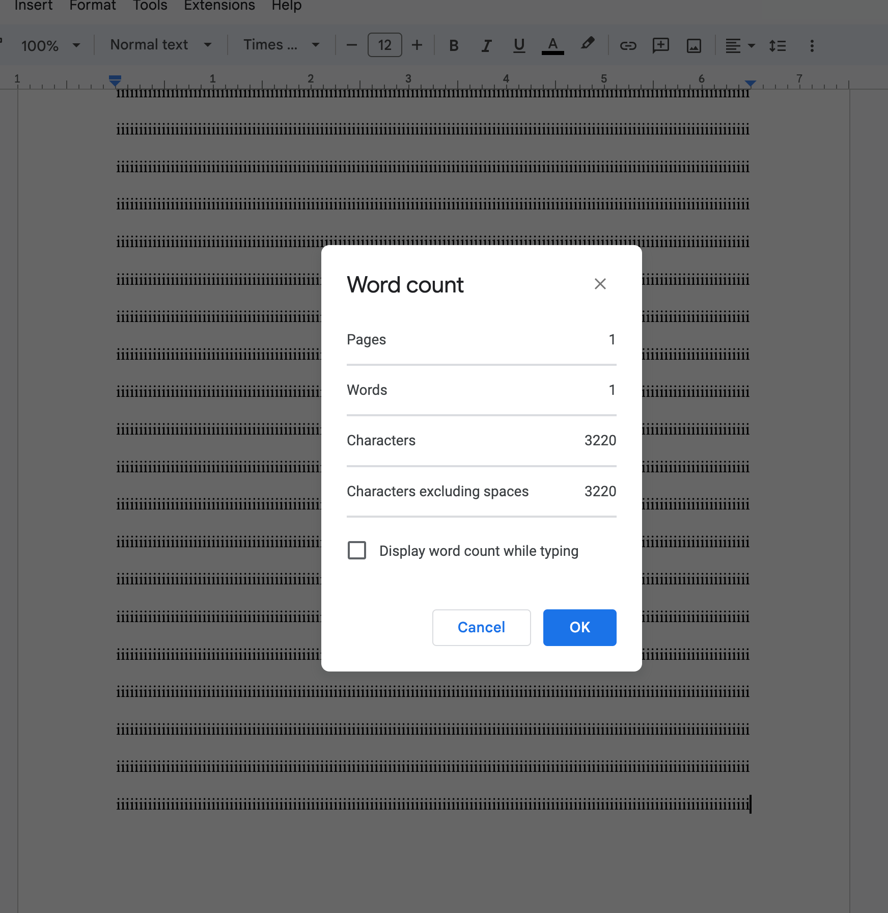

In the JavaScript world, you've probably seen something like this:

 website](../../assets/light-as-a-feather.png)

Sure, it's just an idiom to say that the JavaScript library won't add much to your bundle size (which is something people care very much about). The problem I have with these claims is that you can't actually convert bytes or kilobytes (units of data) to grams or pounds (units of weight).

...or can you?

How would we convert bytes, a unit of data, to grams, a unit of weight? Here's my idea:

1. Get the amount of data we can put on a agreed-on physical medium
2. Get the weight of that medium
3. We now have a proportion of data to weight.

## The intricacies

The most obvious medium for this is paper. Your most ordinary paper.

Apparently, "ordinary paper" isn't specific enough. There's paper of all different sizes: A1, A2, A4, legal, etc. And then there's different materials, too: cardstock, newspaper, tissue, printer paper.

For the sake of this experiment, I'll choose to follow the **MLA format**, the one we learn in school. This dictates that we need to print using your run-of-the-mill US Letter printer paper (8.5 by 11 inches).

Your normal printer paper has a weight density of [70-100 GSM](https://www.digitalprinting.co.uk/support/paper-weight-guide/) (grams per square meter). Taking the median, that would be 85 GSM. An 8.5x11 inch paper has a surface area of 0.06032246 square meters, which is around **5 grams.** 5.1274091 grams to be exact. So that's one part of the equation done.

But now we have to deal with how to put "data" onto the paper. Of course we print things on it, but how should the things be printed? What should be printed?

Again, I'll be follow the MLA format. This means we'll need to format in double line spacing, font size 12, Times New Roman, and 1-inch margins. I'll also _not_ put on a header or page number. MLA format requires single-sided printing, so I'll keep that in mind. That still leaves the question: what data should I put on it?

For this test, since we've already decided to use the space-wasting MLA format, we should compensate for it by letting our data be very dense. In that case, we can cover the document with the letter "i" (narrowest letter in the English alphabet), which takes 1 byte to encode (in UTF-8, [the most popular character encoding on the web as of July 2023](https://en.wikipedia.org/wiki/Popularity_of_text_encodings#Popularity_on_the_World_Wide_Web)).

That's 3220 characters.

## Results

We now know that $3220 \text{ characters} \cdot 1 \text{ byte} = 3220 \text{ bytes}$ can fit on a sheet of MLA-formatted paper. This means that you can fit 3220 bytes onto 5.1274091 grams. The ratio of grams to bytes would be

$$
\frac{5.1274091}{3220} = 0.0015923631
$$

So we now got our conversion rate: convert the amount of **bytes to grams** by multiplying it by **0.0015923631**. Similarly, we can convert the amount of **grams to bytes** by multiplying it by **8627.997481223**.

## Let's have some fun

A feather weighs, on average, [0.0082 grams](https://weightofthing.com/weight-of-feather/). Our paper is around 5 grams. Alkaline AA batteries weigh around [23 grams](<https://en.wikipedia.org/wiki/AA_battery#:~:text=Alkaline%20AA%20cells%20have%20a,31%20g%20(1.1%20oz).>). Apples weigh [70-100g](https://ryansjuice.com/blog/how-many-apples-in-a-pound#:~:text=The%20average%20apple%20is%20between,3%20apples%20in%20a%20pound.).

Let's compare the weights of some popular JavaScript UI libraries (minified + gzip, according to [Bundlephobia](https://bundlephobia.com/)).

| JS Library                      | Weight                                                   |
| ------------------------------- | -------------------------------------------------------- |
| angular@1.8.3                   | 62.3kB                                                   |
| react@18.2.0 + react-dom@18.2.0 | 2.5kB + 42kB = 44.5kB                                    |
| vue@3.3.4                       | 34.6kB                                                   |
| @builder.io/qwik@1.2.6          | 33.3kB                                                   |
| alpinejs@3.12.3                 | 14.4kB                                                   |
| htmx.org@1.9.3                  | 14.1kB                                                   |
| petite-vue@0.4.1                | 6.9kB (the description claims to be a 5kB subset of Vue) |
| preact@10.16.0                  | 4.3kB                                                    |
| svelte@4.0.5                    | 2.6kB                                                    |

React and Angular is around as heavy as an apple. Svelte is about a sheet of paper. Vue and Qwik is around a [slice of bread or 10 nickels](https://weightofstuff.com/10-common-items-that-weigh-about-50-grams/). Alpine and Htmx are around the weight of a battery.

## Testing weight claims

1. PrismJS claims to be "light as a feather", but as of version 1.29.0, it weighs 10.98730539 grams, which is **not** light as a feather (0.0082 grams)
2. [Goober](https://goober.rocks/) claims to be "at the cost of peanuts." As of version 2.1.13, it's around the weight of 4 peanuts. This claim is therefore **true,** as it claims to be peanut**s**, plural.
3. Your library can be weighed by using the equation that I provided: `size in bytes * 0.0015923631 = size in grams`

Have fun!

_- Lyner_
