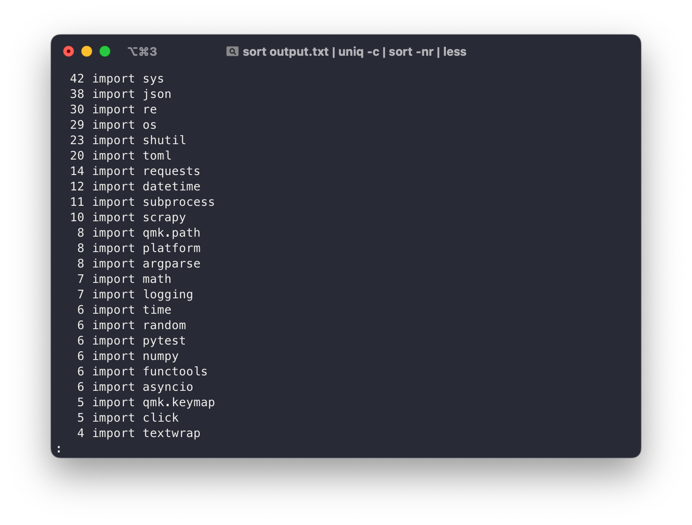

Python's module system stands as a testament to the language's versatility, offering developers a rich ecosystem that encompasses a robust standard library and an extensive repository of over 400 packages on PyPi. The sheer abundance of resources at one's disposal has made Python a go-to choice for countless developers venturing into the realm of application development.

However, amid this expansive array of modules, the question inevitably arises: which one reigns supreme in terms of utility? The answer, intriguingly, is as diverse as the myriad domains Python is employed in.

The singular most useful module is not a one-size-fits-all declaration; instead, it's a subjective matter intimately tied to the unique demands of your specific domain and the objectives you aim to achieve. As the saying goes, "one person's gem is another's incidental tool," and nowhere is this truer than in the multifaceted landscape of Python programming. The optimal module for a data scientist may differ drastically from the preference of a web developer, emphasizing the dynamic adaptability of Python to cater to an array of industries and applications.

What you _can_ count is **what's the singular most _imported_ module**? So today I went into my projects directory

```zsh
$ cd ~/projects
```

And whipped up a [ripgrep](https://github.com/BurntSushi/ripgrep) query

```zsh
$ rg '^import (\w+(\.\w+)*)' --glob '*.py' -N -I --only-matching --hidden --no-ignore > output.txt
$ wc -l output.txt
  177742 output.txt
```

Woah that's a lot of lines. Let's see what's the most common ones:

```zsh
$ sort output.txt | uniq -c | sort -nr | less
```


## The results

Let's start by shining a spotlight on the unsung hero of Python modules – [`sys`](https://docs.python.org/3/library/sys.html). That's surprising. I mean, it's usually not the main star in my main scripts; it's probably just happens to be the most common in those sneaky `.venvs` that lurk in the corners of every Python project. `sys` and [`os`](https://docs.python.org/3/library/os.html) are core core modules for interacting with the operating system and Python itself.

Now, let's talk about the heavyweights – [`warnings`](https://docs.python.org/3/library/warnings.html) and [`logging`](https://docs.python.org/3/library/logging.html). I mean, I never really care to use them in my code; I guess they just happen to exist a lot in _other people's libraries._

Then there's everyone's favorite way to do functional programming – [`functools`](https://docs.python.org/3/library/functools.html) and [`itertools`](https://docs.python.org/3/library/itertools.html). Not surprising considering how useful they are in keeping your code concise.

---

The problem is while a lot of these modules are definitely critical, but that doesn't say much about actual code that _I wrote._

So what if we changed the `rg` query to exclude hidden files:

```zsh
$ rg '^import (\w+(\.\w+)*)' --glob '*.py' -N -I --only-matching > output.txt
```

(see the difference here:

```diff
+ rg '^import (\w+(\.\w+)*)' --glob '*.py' -N -I --only-matching > output.txt
- rg '^import (\w+(\.\w+)*)' --glob '*.py' -N -I --only-matching --hidden --no-ignore > output.txt
```

)

And do our `sort | uniq | sort` magic again?

## The better results



In this case, we still have `sys` as a top contender. BUT this time we also have `json` sitting on top, even before `re` and `os`. It's no surprise to see [`requests`](https://requests.readthedocs.io/en/latest/), [`shutil`](https://docs.python.org/3/library/shutil.html), and [`toml`](https://github.com/uiri/toml) on there as well as those are some very useful modules in a wide variety of real projects.

Hey, look: `argparse` comes up more than `click`! I guess I just didn't use `click` as often as I thought.

## Conclusion

In the vast landscape of Python modules, we've journeyed through some key players that form the backbone of coding endeavors. From the omnipresent sys and its partner in crime os to the pragmatic role players like warnings and logging, each module adds a unique layer to the Python programming experience.

We didn't stop there, delving into the functional elegance of functools and the pragmatic efficiency of itertools. These modules aren't just tools; they're integral contributors, shaping the character of our codebases.

As we conclude, it's clear that choosing the most valuable module is a subjective matter, contingent on your coding habits and project needs. Whether you rely on system-level modules, find utility in logging, or appreciate the streamlined functionality of functools and itertools, Python's module ecosystem is designed for versatility.

As you continue coding, explore the documentation, experiment with new modules, and refine your toolkit. Python's strength lies in its adaptability, and the real magic happens when you curate a set of modules that align with your coding philosophy.

So, keep exploring, keep coding, and may your projects always find the perfect module for the task at hand. Happy coding!
