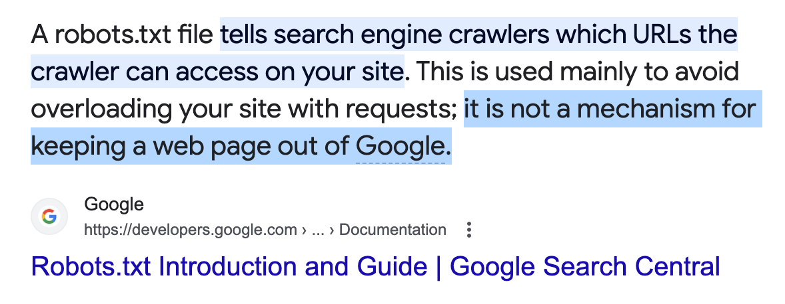
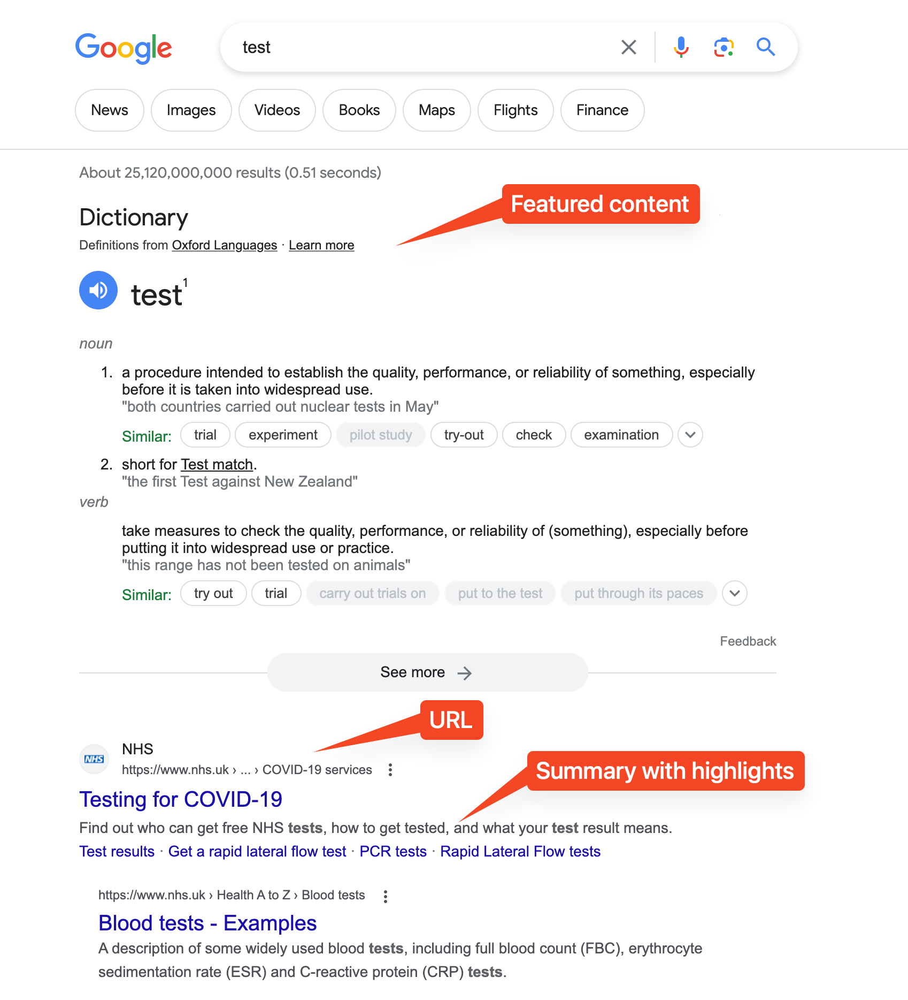

Here's some thoughts on ChatGPT copyright.

How come people are okay with Google scraping their websites? The bots improve Google's own search engine service and therefore its ad revenue. There's nothing really stopping the bot from accessing publicly accessible data maybe except a `robots.txt` file that **they don't even have to follow**.

Heck, SEO are guidelines to make your site MORE scrape-able by Google. So surely people are fine with companies (or at least a company) web-scraping their data for profit. This includes any of your blogs, Reddit comments, poems, song lyrics on Genius.com, etc., etc., etc.

But how come people seems to have problems with ChatGPT being trained on their data (assuming that they follow the same rules as Google)? Is it because it's a [paid service](https://openai.com/blog/introducing-chatgpt-and-whisper-apis)? I thought we already established that people don't care that their content is being scraped for profit. For example, paid search engines do exist and I don't hear of people having problems with those.

Is the problem the lack of clear ranking benefits from letting ChatGPT scrape you? What I mean the predictability of your content being present in ChatGPT’s output is unlike Google which has SEO, ranking algorithms, and well-established methods to get your website on top of the results. You may want to be in the results only if you're going to be benefiting from it. Well, your business or whatnot _should be present_ in ChatGPT's output if you already have good coverage across the internet. This is the same with Google's search engine results anyway.

If there's any other reason that you wouldn't want ChatGPT be trained on your website, then you really should consider how many other people in the internet are also scraping and using your website. Maybe you shouldn't have made that website public in the first place.

So I don't really understand the deal with the "ambiguous copyright of LLMs". Perhaps it's because LLMs generates text? But you could think of Google as generating text as well: it generates a list of URLs, some highlighted text, maybe some featured content all based on a prompt you give. Sure, Google's search results are based on an algorithm but so is ChatGPT (technically speaking).

Is the copyright problem because ChatGPT generates creative works? If so, then LLMs are subject to the same dilemma as image/art generation tools, since art is also a type of creative work. Here’s how I think of it.

High quality image generation tools may be recent, but image distortion has been here for a while. Stable Diffusion, an AI image generator, is a diffusion model. How is this related to image distortion? I would argue that [based on how Stable Diffusion works](https://stable-diffusion-art.com/how-stable-diffusion-work/), it's essentially just a very fancy, customizable, image distorter (except it distorts the image in a way that removes noise). Therefore, I think image generation tools are subject to the same copyright as image distortion tools, which seems to be obviously completely free of copyright.

Except, it's not that simple. What people argue about is the copyright of the model’s training data. Training an AI model requires training data, and that training data may have some copyright (or people complaining that they don't want their works to be trained on), which propagates to the final model. [People have already tried to sue for this](https://www.theverge.com/2023/1/17/23558516/ai-art-copyright-stable-diffusion-getty-images-lawsuit). We need to deal with the copyright of the training data, which brings us back full circle 🤷‍♂️.

What do I think LLM copyright should be? ChatGPT output should be under the same copyright Google search results are under which is none: Google search results are from its patented algorithm, [PageRank](https://en.wikipedia.org/wiki/PageRank). [According to ChatGPT](https://chat.openai.com/share/1bd141a7-0051-434d-b48e-10715e306632), this means Google doesn't own the content of its search results. Keep in mind that Google removes pages from its search results ~~that violate the DMCA~~ that get DMCA takedown requests or are explicitly [requested not to be indexed](https://developers.google.com/search/docs/crawling-indexing/block-indexing#:~:text=noindex%20is%20a%20rule%20set,noindex%20rule%2C%20such%20as%20Google.), which I guess you should try to do if you're genuinely angry about your website being part of the GPT's training data.
